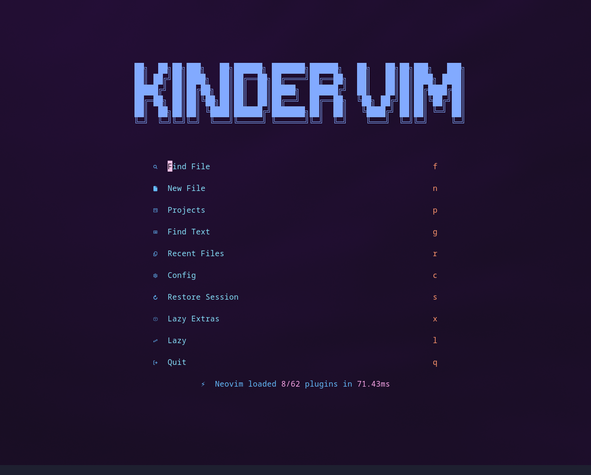
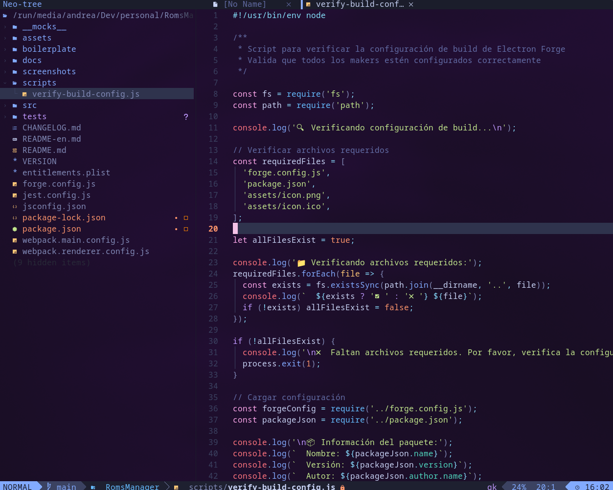

# ⚡ Neovim IDE — Local-First & 12-Factor Architecture

Configuración avanzada de Neovim construida sobre [LazyVim](https://github.com/LazyVim/LazyVim), diseñada bajo principios de **arquitectura limpia**, **privacidad absoluta (Zero Data Leakage)** y **separación estricta entre código y configuración (12-Factor App)**.

---

## 📸 Vista Previa

### 🖥️ Dashboard (Kinder Vim)


### 💻 Entorno de Desarrollo (Neo-tree & Edición)


---

## 🎯 Filosofía y Principios de Diseño

1. **100% IA Local**: Todos los modelos de asistencia de código y chat interactivo se ejecutan en tu propia máquina (Llama.app / Apple Silicon MLX / llama.cpp). Cero telemetría hacia servicios externos en la nube.
2. **Inversión de Control (Factor III)**: Ni endpoints, ni puertos, ni rutas personales de carpetas están hardcodeados en el código Lua. La infraestructura se inyecta desde variables de entorno con fallbacks seguros.
3. **Rendimiento Nativo**: Autocompletado impulsado por `blink.cmp` (escrito en Rust), carga perezosa (*lazy loading*) para más de 20 temas de color y animaciones no esenciales desactivadas para respuesta instantánea.
4. **Sistema de Conocimiento Integrado**: Flujo de notas Zettelkasten y gestión de proyectos sincronizados entre `obsidian.nvim` y `calendar.vim`.

---

## 🏗️ Arquitectura de la Configuración

```text
nvim/
├── assets/                         # Capturas de pantalla y recursos visuales
├── init.lua                        # Punto de entrada de Neovim
├── lazy-lock.json                  # Lockfile declarativo de plugins
├── lua/
│   ├── config/                     # Core del editor
│   │   ├── lazy.lua                # Arranque de lazy.nvim y extras
│   │   ├── options.lua             # Opciones de Neovim (background, números)
│   │   ├── keymaps.lua             # Mapeos globales
│   │   ├── autocmds.lua            # Autocomandos
│   │   ├── nodejs.lua              # Heurística de aislamiento del runtime Node.js
│   │   └── remote_clipboard.lua    # Portapapeles OSC 52 para Tmux/SSH
│   ├── pi/
│   │   └── init.lua                # Módulo local de integración con Pi Code CLI
│   └── plugins/                    # Plugins modulares (cargados por lazy.nvim)
│       ├── ai.lua                  # Minuet AI (autocompletado local compatible con OpenAI)
│       ├── pi.lua                  # Pi Assistant (terminal flotante y split interactivo)
│       ├── completion.lua          # Blink.cmp + integraciones LSP (PHP, TS/JS, Emmet)
│       ├── obsidian.lua            # Bóveda de Obsidian, workspaces y gestión de proyectos
│       ├── calendar.lua            # Vista de calendario integrada con notas diarias
│       ├── render-markdown.lua     # Renderizado enriquecido de Markdown en tiempo real
│       ├── all-themes.lua          # 20+ temas cargados perezosamente (lazy = true)
│       ├── omarchy-theme-hotreload.lua # Recarga en caliente del tema en ejecución
│       └── snacks-animated-scrolling-off.lua # Optimización de rendimiento UI
```

---

## ⚙️ Variables de Entorno (Reference)

Puedes exportar estas variables en tu shell (`~/.zshrc` o `~/.zshenv`) para personalizar endpoints y ubicaciones sin tocar código:

### 1. IA Local (Autocompletado & Chat)

| Variable | Descripción | Valor por defecto |
| :--- | :--- | :--- |
| `LLAMA_APP_ENDPOINT` | Endpoint HTTP para autocompletado en línea | `http://127.0.0.1:9931/v1/chat/completions` |
| `LLAMA_APP_MODEL` | Modelo local para autocompletado | `ggml-org/gemma-4-E2B-it-GGUF:Q8_0` |
| `LLAMA_APP_API_KEY` | Clave API del servidor local | `"none"` |
| `PI_COMMAND` | Binario del CLI interactivo | `"pi"` |
| `PI_PROVIDER` | Proveedor del CLI interactivo | `"llama-app"` |
| `PI_MODEL` | Modelo a utilizar en el CLI interactivo | `ggml-org/gemma-4-E2B-it-GGUF:Q8_0` |
| `MLX_SERVER_URL` | URL de verificación del servidor local Apple MLX | `http://127.0.0.1:8080/v1/models` |

### 2. Obsidian & Calendario de Notas

| Variable | Descripción | Valor por defecto |
| :--- | :--- | :--- |
| `OBSIDIAN_VAULT_PATH` | Ruta absoluta de tu bóveda de notas | `/Volumes/Files/notes` (o `~/Work/notes`) |
| `OBSIDIAN_DEFAULT_WORKSPACE` | Nombre del workspace principal | `"notes"` |
| `OBSIDIAN_NOTES_SUBDIR` | Subcarpeta de notas Zettelkasten | `"zettelkasten"` |
| `OBSIDIAN_PROJECTS_FOLDER` | Subcarpeta de proyectos | `"projects"` |
| `OBSIDIAN_DAILY_FOLDER` | Subcarpeta para el diario / notas diarias | `"journal"` |
| `OBSIDIAN_DAILY_TEMPLATE` | Nombre del archivo de plantilla diaria | `"plantilla-diaria.md"` |
| `OBSIDIAN_TEMPLATES_FOLDER` | Subcarpeta de plantillas generales | `"templates"` |
| `OBSIDIAN_ATTACHMENTS_FOLDER`| Subcarpeta para imágenes y adjuntos | `"assets"` |
| `NOTES_JOURNAL_DIR` | Override para la ruta absoluta del diario | `$VAULT/$OBSIDIAN_DAILY_FOLDER` |
| `NOTES_DAILY_TEMPLATE_PATH` | Override para la ruta absoluta de la plantilla | `$VAULT/$TEMPLATES/$TEMPLATE` |

---

## ⌨️ Atajos de Teclado Principales (Cheat Sheet)

### Asistencia de IA Local
* `<leader>aa` — Abrir/Cerrar Pi Assistant en panel lateral (Split vertical)
* `<leader>af` — Abrir/Cerrar Pi Assistant en ventana flotante centrada
* `<leader>ac` — Enviar el archivo actual como contexto a Pi
* `<leader>ad` — Enviar el directorio y estructura del proyecto actual como contexto a Pi
* `<leader>as` — *(Modo Visual)* Enviar fragmento seleccionado como contexto a Pi
* `<A-y>` — Forzar solicitud de sugerencia de completado en línea con Minuet AI

### Gestión de Notas & Proyectos (Obsidian)
* `<leader>of` — Buscar notas rápidamente por título o alias
* `<leader>os` — Búsqueda de texto completo (Grep) en toda la bóveda
* `<leader>on` — Crear nueva nota en Zettelkasten
* `<leader>od` — Abrir o crear la nota diaria de hoy
* `<leader>oc` — Abrir calendario visual interactivo (navega con `Enter` para abrir notas)
* `<leader>opn` — Crear nota dentro de un proyecto específico
* `<leader>opf` — Buscar notas exclusivas dentro de un proyecto
* `<leader>ops` — Búsqueda de texto (Grep) dentro de un proyecto

---

## 🧪 Verificación y Diagnóstico

Para comprobar la integridad sintáctica y la inicialización limpia de todos los módulos sin abrir la interfaz gráfica:

```bash
nvim --headless +qa
```

Si la ejecución termina con código de salida `0` y sin mensajes de error, la configuración está completamente lista para producción.
